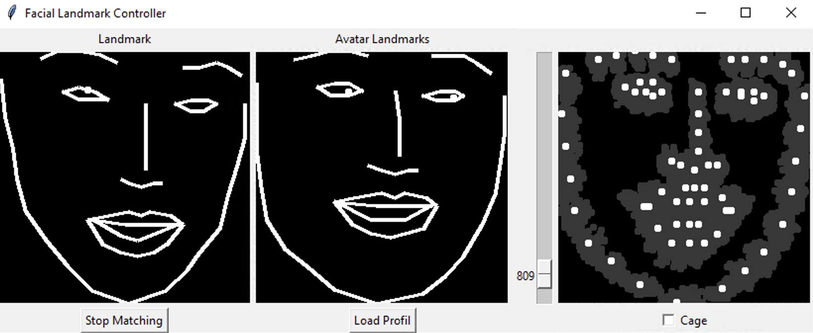

# RGBD-Face-Avatar-GAN

This repository based on my [bachelor thesis](Docu/Bachelorarbeit_Alexander_Pech_736825.pdf) at HS-Düsseldorf and was supported by [MIREVI](https://mirevi.de). 

The basic GAN architecture is the [Pix2Pix-GAN by Isola et al.](https://phillipi.github.io/pix2pix/). 
Some basic code parts came from or are based on their [Pix2Pix-Pytorch-implementation](https://github.com/junyanz/pytorch-CycleGAN-and-pix2pix).

### Requirements

- Python 3.6 or 3.7 
- numpy
- PyTorch >1.4 (with Cuda >10.1)
- Torchvision 0.5
- Open3D
- OpenCV 4
- matplotlib
- tqdm
- face-alignment (install PyTorch before)

## Create Dataset

Create a folder with the dataset name in `Data` and edit `DatasetName` in `config.py` to the name of the dataset folder.
`FlipYAxis` should be `False` in most cases.

You need rgbd-images in form of an 8bit rgb image and 16bit depth image. 
Put the rgb images under `Data/Dataset_Person_A/RGB/` and the depth images under `Data/Dataset_Person_A/Depth/`.

A tool for creating the dataset automatical with an rgbd-camera is still under construction.

If you run `RGBDfaceDataset.py`, the folder `Visualization` contains the complete dataset in a visible form. 
Ths is not necessary for training and only for debug.

## Training

Run `train.py`.

## Test

Run `test.py` in order to test the model with a webcam. The window that opens shows: 

| webcam-input | facial landmarks | synthesized RGB image | synthesized depthmap |
|---|---|---|---|

## Demo

The [project page](https://mirevi.de/projects/personalized-avatars-generated-by-a-neural-network-for-telepresence-and-mixed-reality) at MIREVI contains a demo video
(without Facial-Landmark-Controller).

### Facial Landmark Controller

The Facial Landmark Controller offers the possibility to apply the relative input movement to an 
facial landmark set from the dataset. This improves the result if the avatar of one person is 
controlled by another person or the landmarks come from different sources and have to be merged. 

**How to use the Facial Landmark Controller:**
1. Press `Load Profil` to load all facial landmarks to the Facial Landmark Controller.   <small>(The folder 
`Dataset` has to contain `Landmark.txt` in which all landmarks are stored. This file will be 
created at the begin of the training. If this file doesn't exist run `Dataset/RGBDFaceDataset.py` 
from the root directory.)</small>  
2. Choose a suitable facial landmark set with the slider on the right.   
3. Try to imitate the chosen facial expression as well as possible.  
4. Press `Start Matching`. The relative* input movement will now apply to the the chosen facial 
landmark set and the resulted heatmap will send to the GAN.
5. The option "cage" allows only positions from the dataset for each landmark.   

*(relative to the face expression when the button is pressed)

## Evaluation

## Annotations

- The eytracking used in `test.py` is currently very prone to errors in different recording situations.

## Further Links

- https://mirevi.de/projects/personalized-avatars-generated-by-a-neural-network-for-telepresence-and-mixed-reality
